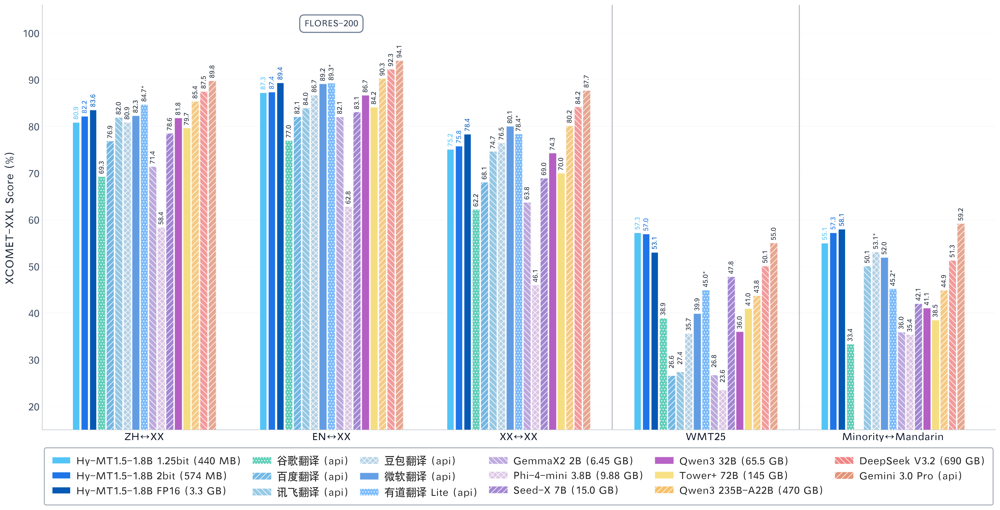
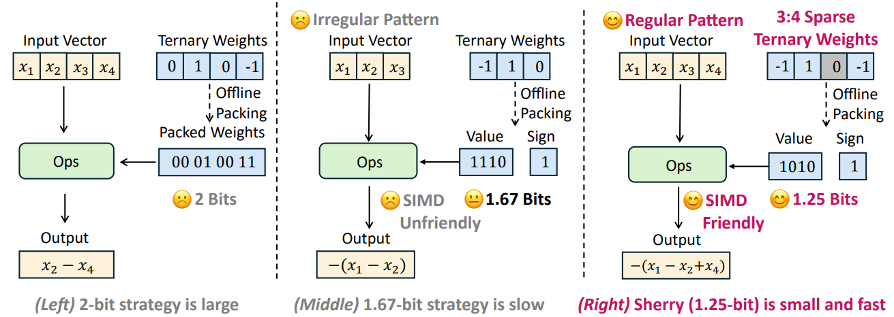
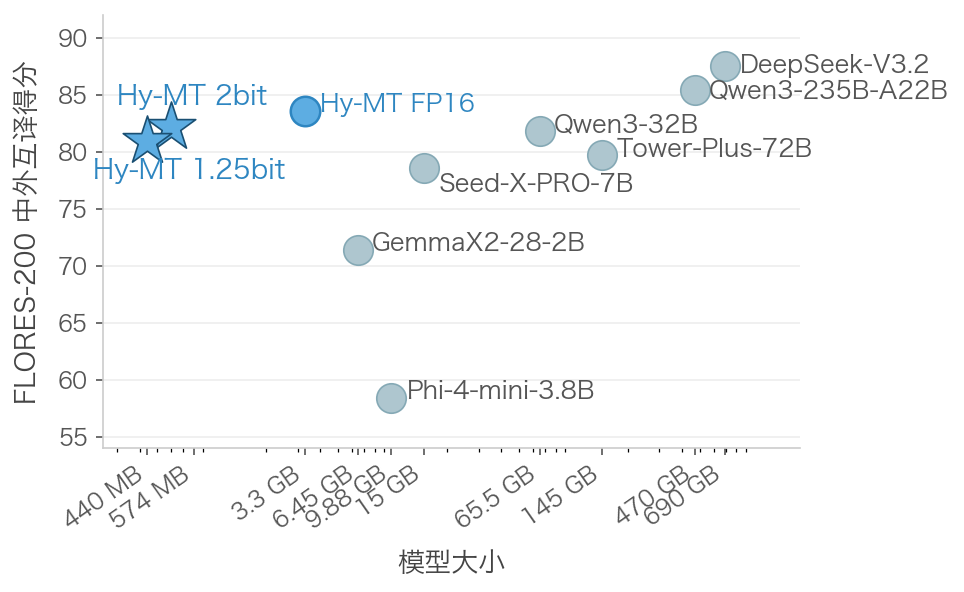
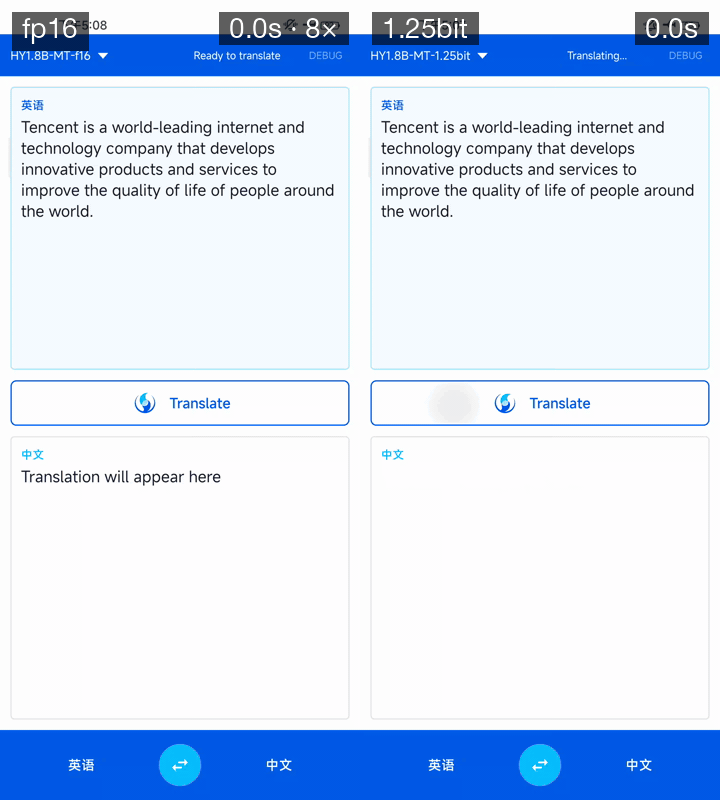
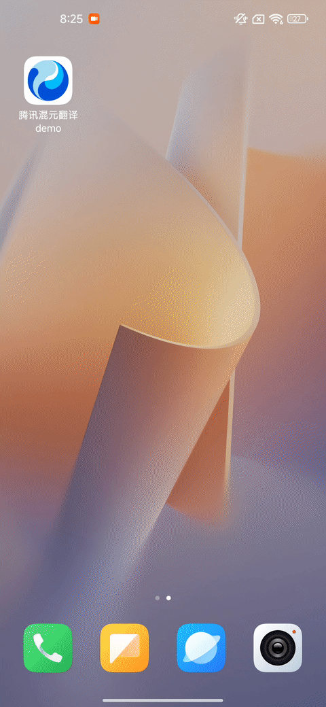
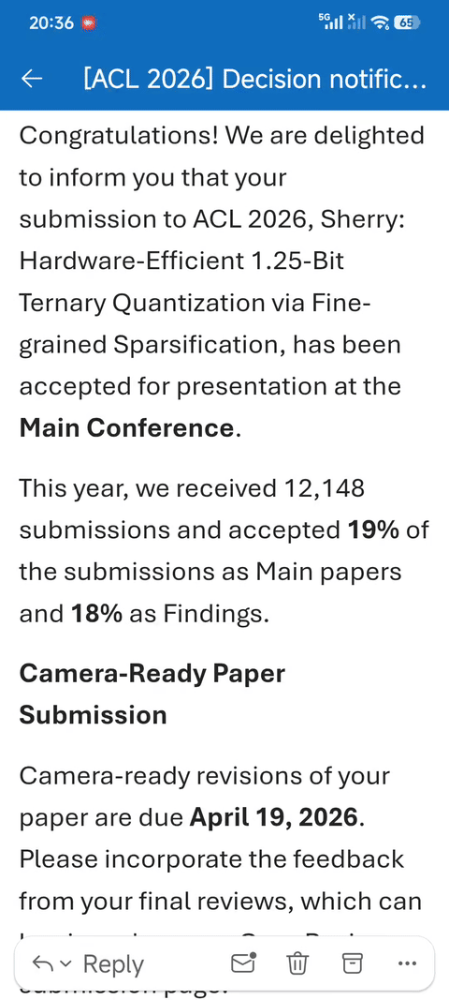

### Dedicated to building a more intuitive, comprehensive, and efficient LLMs compression toolkit.

📱 [Android Demo](https://huggingface.co/AngelSlim/Hy-MT1.5-1.8B-2bit-GGUF/resolve/main/Hy-MT-demo.apk?download=true) | 📣 [GGUF](https://huggingface.co/AngelSlim/Hy-MT1.5-1.8B-1.25bit-GGUF) | ✒️ [Sherry Paper (ACL 2026)](https://arxiv.org/abs/2601.07892) | 📖 [Documentation](https://angelslim.readthedocs.io/) | 🤗 [AngelSlim](https://huggingface.co/AngelSlim) | 💬 [WeChat](../../../assets/external/github.com/dd78c59651e0c22c.png)

  
*Hy-MT1.5-1.8B translation quality scores. Source: [HY-MT1.5 Technical Report](https://arxiv.org/abs/2512.24092)*

## 📣 Latest News

- \[26/05/08\] **We have released STQ1\_0 kernel for 1.25-bit model** and given a PR to llama.cpp [PR #22836](https://github.com/ggml-org/llama.cpp/pull/22836)! If you have any questions or suggestions for STQ\_0, welcome to comment under the PR!🔥🔥🔥
- \[26/04/29\] We have released **Hy-MT1.5-1.8B-2bit (574MB)** and **Hy-MT1.5-1.8B-1.25bit (440MB)**, on-device translation models supporting 33 languages, with both weights and GGUF formats available. We have also made an [Android Demo](https://huggingface.co/AngelSlim/Hy-MT1.5-1.8B-2bit-GGUF/resolve/main/Hy-MT-demo.apk?download=true) for you to try out. We invite you to give it a spin! 🔥🔥🔥
- \[26/02/09\] We have released HY-1.8B-2Bit, 2-bit on-device large language model.
- \[26/01/13\] We have released v0.3. We support the training and deployment of Eagle3 for all-scale LLMs/VLMs/Audio models. And we released **Sherry**, the hardware-efficient 1.25-bit quantization algorithm [\[Paper\]](https://arxiv.org/abs/2601.07892) | [\[Code\]](https://github.com/Tencent/AngelSlim/tree/sherry/Sherry)

For more detailed information, please refer to [\[AngelSlim\]](https://github.com/Tencent/AngelSlim) and [\[HY-MT\]](https://github.com/Tencent-Hunyuan/HY-MT)

## 🌟 Hy-MT1.5-1.8B-1.25bit Key Features

- **World-Class Translation Quality** Hy-MT1.5-1.8B-1.25bit is built upon the Hy-MT1.5-1.8B foundation model, a specialized translation model developed by Tencent Hunyuan Team through a holistic multi-stage training pipeline integrating MT-oriented pre-training, supervised fine-tuning, on-policy distillation, and reinforcement learning. The base model natively supports **33 languages**, **5 dialects/minority languages**, and **1,056 translation directions**. With only 1.8B parameters, it comprehensively outperforms much larger open-source models (e.g., Tower-Plus-72B, Qwen3-32B) and mainstream commercial translation APIs (e.g., Microsoft Translator, Doubao Translator). For full details, please refer to the [HY-MT1.5 Technical Report](https://arxiv.org/abs/2512.24092).
- **Sherry: Extreme 1.25-bit Quantization** This model employs [**Sherry**](https://arxiv.org/abs/2601.07892) (accepted at **ACL 2026**), a hardware-efficient ternary quantization framework. Sherry introduces a **3:4 fine-grained sparsity** strategy: for every 4 model weights, the 3 most important are stored in 1-bit ({-1, +1}), while the remaining 1 is zeroed out. This packs 4 weights into just 5 bits, achieving an effective **1.25-bit** width with power-of-two alignment, compressing the original 3.3GB FP16 model to just **440MB**, with minimal accuracy loss.

  
*Sherry fine-grained sparsity: for every 4 weights, the 3 most important are stored in 1-bit, and the remaining 1 is zeroed out.*

- **On-Device Deployment for the Most Phones** Paired with our custom **STQ kernel** designed specifically for mobile CPUs, the 1.25-bit model achieves perfect SIMD instruction set alignment. This means even ordinary phones with limited memory can run high-quality offline translation smoothly. No internet connection required, and your data never leaves the device.

## 📈 Translation Benchmarks

Performance comparison of different model sizes on the Flores-200 Chinese-Foreign mutual translation benchmark:

  
*Performance of different model sizes on the Flores-200 Chinese-Foreign mutual translation benchmark.*

## ⚡ Speed Demo

FP16 (8x speed) vs. 1.25-bit speed comparison. Demo device: Snapdragon 888, 8GB RAM:

  
*Demo device: Snapdragon 888, 8GB RAM.*

## 📱 Demo

We provide a ready-to-use Android demo for offline translation. The demo features a **background word extraction mode** that works across any app on your phone — browse emails, webpages, or chat messages and get instant translations without switching apps. No network required, no data collection, one-time download for permanent use.

**Download Demo:**

[https://huggingface.co/AngelSlim/Hy-MT1.5-1.8B-1.25bit-GGUF/resolve/main/Hy-MT-demo.apk](https://huggingface.co/AngelSlim/Hy-MT1.5-1.8B-1.25bit-GGUF/resolve/main/Hy-MT-demo.apk)

### Translation Demo

  
*Demo device: Snapdragon 865, 8GB RAM.*

### Background Word Extraction Mode

  
*Demo device: Snapdragon 7+ Gen 2, 16GB RAM.*

## ❕ Usage

### Clone llama.cpp

```bash
git clone https://github.com/ggml-org/llama.cpp.git
```

### Enter the llama.cpp folder

```bash
cd llama.cpp
```

### Fetch and check out the PR branch

```bash
git fetch origin pull/22836/head:pr-22836-stq_0
git checkout pr-22836-stq_0
```

### Build llama.cpp

```bash
pip install -r requirements.txt
cmake -B build
cmake --build build --config Release
```

### Download the HF model

```bash
pip install huggingface_hub
huggingface-cli download AngelSlim/Hy-MT1.5-1.8B-1.25bit \
    --local-dir model_zoo/Hy-MT1.5-1.8B-1.25bit
```

### Convert HF → bf16 GGUF

```bash
python convert_hf_to_gguf.py model_zoo/Hy-MT1.5-1.8B-1.25bit \
    --outfile model_zoo/Hy-MT1.5-1.8B-bf16.gguf \
    --outtype bf16
```

### Quantize bf16 → STQ1\_0

```bash
./build/bin/llama-quantize \
    model_zoo/Hy-MT1.5-1.8B-bf16.gguf \
    model_zoo/Hy-MT1.5-1.8B-STQ1_0.gguf \
    STQ1_0
```

### Run a completion example

```bash
./build/bin/llama-completion \
  --model model_zoo/Hy-MT1.5-1.8B-STQ1_0.gguf \
  -p "Translate the following segment into Chinese, without additional explanation：Hello" \
  --jinja \
  -ngl 0 \
  -n 64 -st
```

### Run the llama.cpp benchmark

```bash
./build/bin/llama-bench -m model_zoo/Hy-MT1.5-1.8B-STQ1_0.gguf -ngl 0
```

## 📥 Download Links

- 1.25-bit model weights: [https://huggingface.co/AngelSlim/Hy-MT1.5-1.8B-1.25bit](https://huggingface.co/AngelSlim/Hy-MT1.5-1.8B-1.25bit)
- 1.25-bit model GGUF: [https://huggingface.co/AngelSlim/Hy-MT1.5-1.8B-1.25bit-GGUF](https://huggingface.co/AngelSlim/Hy-MT1.5-1.8B-1.25bit-GGUF)
- 2-bit model weights: [https://huggingface.co/AngelSlim/Hy-MT1.5-1.8B-2bit](https://huggingface.co/AngelSlim/Hy-MT1.5-1.8B-2bit)
- 2-bit model GGUF: [https://huggingface.co/AngelSlim/Hy-MT1.5-1.8B-2bit-GGUF](https://huggingface.co/AngelSlim/Hy-MT1.5-1.8B-2bit-GGUF)
- Demo: [https://huggingface.co/AngelSlim/Hy-MT1.5-1.8B-1.25bit-GGUF/resolve/main/Hy-MT-demo.apk](https://huggingface.co/AngelSlim/Hy-MT1.5-1.8B-1.25bit-GGUF/resolve/main/Hy-MT-demo.apk)

## 📄 Technical Reports

- HY-MT1.5 Technical Report: [https://arxiv.org/abs/2512.24092](https://arxiv.org/abs/2512.24092)
- Sherry Paper (ACL 2026): [https://arxiv.org/abs/2601.07892](https://arxiv.org/abs/2601.07892)
- AngelSlim Technical Report: [https://arxiv.org/abs/2602.21233](https://arxiv.org/abs/2602.21233)

## 📝 License

The code for this project is open-sourced under the [License for AngelSlim](https://huggingface.co/AngelSlim/Hy-MT1.5-1.8B-1.25bit/blob/main/LICENSE).

## 🔗 Citation

```
@misc{huang2026sherry,
      title={Sherry: Hardware-Efficient 1.25-Bit Ternary Quantization via Fine-grained Sparsification}, 
      author={Hong Huang and Decheng Wu and Qiangqiang Hu and Guanghua Yu and Jinhai Yang and Jianchen Zhu and Xue Liu and Dapeng Wu},
      year={2026},
      eprint={2601.07892},
      archivePrefix={arXiv},
      primaryClass={cs.LG},
      url={https://arxiv.org/abs/2601.07892}, 
}

@article{angelslim2026,
  title={AngelSlim: A more accessible, comprehensive, and efficient toolkit for large model compression},
  author={Hunyuan AI Infra Team},
  journal={arXiv preprint arXiv:2602.21233},
  year={2026}
}

@misc{zheng2025hymt,
      title={HY-MT1.5 Technical Report}, 
      author={Mao Zheng and Zheng Li and Tao Chen and Mingyang Song and Di Wang},
      year={2025},
      eprint={2512.24092},
      archivePrefix={arXiv},
      primaryClass={cs.CL},
      url={https://arxiv.org/abs/2512.24092}, 
}
```

## 💬 Technical Discussion

- AngelSlim is continuously iterating and new features will be released soon. If you have any questions or suggestions, please open an issue on [GitHub Issues](https://github.com/Tencent/AngelSlim/issues) or join our [WeChat discussion group](../../../assets/external/github.com/dd78c59651e0c22c.png).

## Model tree for AngelSlim/Hy-MT1.5-1.8B-1.25bit

Base model

[tencent/HY-MT1.5-1.8B](https://huggingface.co/tencent/HY-MT1.5-1.8B)

Finetuned

([38](https://huggingface.co/models?other=base_model:finetune:tencent/HY-MT1.5-1.8B))

this model

Quantizations

[2 models](https://huggingface.co/models?other=base_model:quantized:AngelSlim/Hy-MT1.5-1.8B-1.25bit)

## Space using AngelSlim/Hy-MT1.5-1.8B-1.25bit 1

## Collection including AngelSlim/Hy-MT1.5-1.8B-1.25bit[6 items • Updated • 10](https://huggingface.co/collections/AngelSlim/hy-low-bit-model)