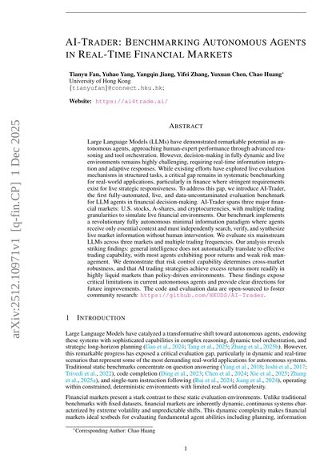
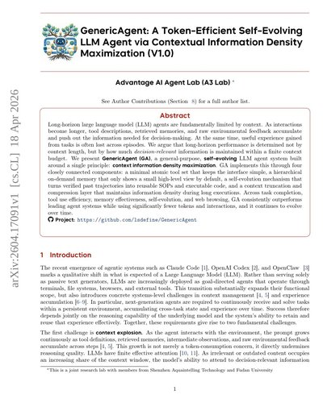
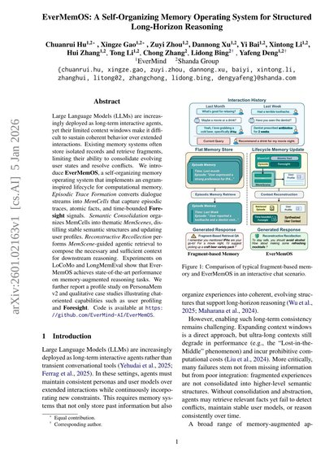
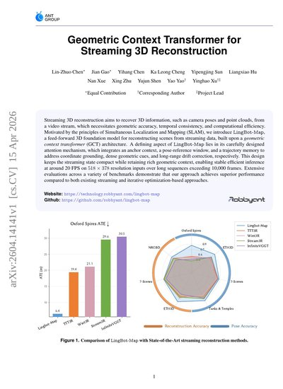

30 papers

### AI-Trader: Benchmarking Autonomous Agents in Real-Time Financial Markets

Tianyu Fan, Yuhao Yang, Yangqin Jiang, +3 authors ·

Large Language Models (LLMs) have demonstrated remarkable potential as autonomous agents, approaching human-expert performance through advanced reasoning and tool orchestration. However, decision-making in fully dynamic and live environments remains highly challenging, requiring real-time information integration and adaptive responses. While existing efforts have explored live evaluation mechanisms in structured tasks, a critical gap remains in systematic benchmarking for real-world applications, particularly in finance where stringent requirements exist for live strategic responsiveness. To address this gap, we introduce AI-Trader, the first fully-automated, live, and data-uncontaminated evaluation benchmark for LLM agents in financial decision-making. AI-Trader spans three major financial markets: U.S. stocks, A-shares, and cryptocurrencies, with multiple trading granularities to simulate live financial environments. Our benchmark implements a revolutionary fully autonomous minimal information paradigm where agents receive only essential context and must independently search, verify, and synthesize live market information without human intervention. We evaluate six mainstream LLMs across three markets and multiple trading frequencies. Our analysis reveals striking findings: general intelligence does not automatically translate to effective trading capability, with most agents exhibiting poor returns and weak risk management. We demonstrate that risk control capability determines cross-market robustness, and that AI trading strategies achieve excess returns more readily in highly liquid markets than policy-driven environments. These findings expose critical limitations in current autonomous agents and provide clear directions for future improvements. The code and evaluation data are open-sourced to foster community research: https://github.com/HKUDS/AI-Trader.

AgentsLanguage Modeling

[

18.2k

stars

↑5.5

stars / hr

](https://github.com/HKUDS/AI-Trader)

### GenericAgent: A Token-Efficient Self-Evolving LLM Agent via Contextual Information Density Maximization (V1.0)

Jiaqing Liang, Jinyi Han, Weijia Li, +15 authors · Apr 18, 2026

Long-horizon large language model (LLM) agents are fundamentally limited by context. As interactions become longer, tool descriptions, retrieved memories, and raw environmental feedback accumulate and push out the information needed for decision-making. At the same time, useful experience gained from tasks is often lost across episodes. We argue that long-horizon performance is determined not by context length, but by how much decision-relevant information is maintained within a finite context budget. We present GenericAgent (GA), a general-purpose, self-evolving LLM agent system built around a single principle: context information density maximization. GA implements this through four closely connected components: a minimal atomic tool set that keeps the interface simple, a hierarchical on-demand memory that only shows a small high-level view by default, a self-evolution mechanism that turns verified past trajectories into reusable SOPs and executable code, and a context truncation and compression layer that maintains information density during long executions. Across task completion, tool use efficiency, memory effectiveness, self-evolution, and web browsing, GA consistently outperforms leading agent systems while using significantly fewer tokens and interactions, and it continues to evolve over time. Project: https://github.com/lsdefine/GenericAgent

Language Modeling

[

11.8k

stars

↑3.8

stars / hr

](https://github.com/lsdefine/GenericAgent)

### EverMemOS: A Self-Organizing Memory Operating System for Structured Long-Horizon Reasoning

Chuanrui Hu, Xingze Gao, Zuyi Zhou, +8 authors · Jan 5, 2026

Large Language Models (LLMs) are increasingly deployed as long-term interactive agents, yet their limited context windows make it difficult to sustain coherent behavior over extended interactions. Existing memory systems often store isolated records and retrieve fragments, limiting their ability to consolidate evolving user states and resolve conflicts. We introduce EverMemOS, a self-organizing memory operating system that implements an engram-inspired lifecycle for computational memory. Episodic Trace Formation converts dialogue streams into MemCells that capture episodic traces, atomic facts, and time-bounded Foresight signals. Semantic Consolidation organizes MemCells into thematic MemScenes, distilling stable semantic structures and updating user profiles. Reconstructive Recollection performs MemScene-guided agentic retrieval to compose the necessary and sufficient context for downstream reasoning. Experiments on LoCoMo and LongMemEval show that EverMemOS achieves state-of-the-art performance on memory-augmented reasoning tasks. We further report a profile study on PersonaMem v2 and qualitative case studies illustrating chat-oriented capabilities such as user profiling and Foresight. Code is available at https://github.com/EverMind-AI/EverMemOS.

Language Modeling

[

4.9k

stars

↑1.6

stars / hr

](https://github.com/EverMind-AI/EverMemOS)

### Geometric Context Transformer for Streaming 3D Reconstruction

Lin-Zhuo Chen, Jian Gao, Yihang Chen, +8 authors · Apr 15, 2026

Streaming 3D reconstruction aims to recover 3D information, such as camera poses and point clouds, from a video stream, which necessitates geometric accuracy, temporal consistency, and computational efficiency. Motivated by the principles of Simultaneous Localization and Mapping (SLAM), we introduce LingBot-Map, a feed-forward 3D foundation model for reconstructing scenes from streaming data, built upon a geometric context transformer (GCT) architecture. A defining aspect of LingBot-Map lies in its carefully designed attention mechanism, which integrates an anchor context, a pose-reference window, and a trajectory memory to address coordinate grounding, dense geometric cues, and long-range drift correction, respectively. This design keeps the streaming state compact while retaining rich geometric context, enabling stable efficient inference at around 20 FPS on 518 x 378 resolution inputs over long sequences exceeding 10,000 frames. Extensive evaluations across a variety of benchmarks demonstrate that our approach achieves superior performance compared to both existing streaming and iterative optimization-based approaches.

3D understanding

[

6.5k

stars

↑1.7

stars / hr

](https://github.com/robbyant/lingbot-map)

### Pixal3D: Pixel-Aligned 3D Generation from Images

Dong-Yang Li, Wang Zhao, Yuxin Chen, +5 authors · May 11, 2026

Recent advances in 3D generative models have rapidly improved image-to-3D synthesis quality, enabling higher-resolution geometry and more realistic appearance. Yet fidelity, which measures pixel-level faithfulness of the generated 3D asset to the input image, still remains a central bottleneck. We argue this stems from an implicit 2D-3D correspondence issue: most 3D-native generators synthesize shape in canonical space and inject image cues via attention, leaving pixel-to-3D associations ambiguous. To tackle this issue, we draw inspiration from 3D reconstruction and propose Pixal3D, a pixel-aligned 3D generation paradigm for high-fidelity 3D asset creation from images. Instead of generating in a canonical pose, Pixal3D directly generates 3D in a pixel-aligned way, consistent with the input view. To enable this, we introduce a pixel back-projection conditioning scheme that explicitly lifts multi-scale image features into a 3D feature volume, establishing direct pixel-to-3D correspondence without ambiguity. We show that Pixal3D is not only scalable and capable of producing high-quality 3D assets, but also substantially improves fidelity, approaching the fidelity level of reconstruction. Furthermore, Pixal3D naturally extends to multi-view generation by aggregating back-projected feature volumes across views. Finally, we show pixel-aligned generation benefits scene synthesis, and present a modular pipeline that produces high-fidelity, object-separated 3D scenes from images. Pixal3D for the first time demonstrates 3D-native pixel-aligned generation at scale, and provides a new inspiring way towards high-fidelity 3D generation of object or scene from single or multi-view images. Project page: https://ldyang694.github.io/projects/pixal3d/

3D generation3D understanding

[

1.1k

stars

↑2.5

stars / hr

](https://github.com/TencentARC/Pixal3D)

### dots.ocr: Multilingual Document Layout Parsing in a Single Vision-Language Model

Yumeng Li, Guang Yang, Hao liu, +2 authors · Dec 2, 2025

Document Layout Parsing serves as a critical gateway for Artificial Intelligence (AI) to access and interpret the world's vast stores of structured knowledge. This process,which encompasses layout detection, text recognition, and relational understanding, is particularly crucial for empowering next-generation Vision-Language Models. Current methods, however, rely on fragmented, multi-stage pipelines that suffer from error propagation and fail to leverage the synergies of joint training. In this paper, we introduce dots.ocr, a single Vision-Language Model that, for the first time, demonstrates the advantages of jointly learning three core tasks within a unified, end-to-end framework. This is made possible by a highly scalable data engine that synthesizes a vast multilingual corpus, empowering the model to deliver robust performance across a wide array of tasks, encompassing diverse languages, layouts, and domains. The efficacy of our unified paradigm is validated by state-of-the-art performance on the comprehensive OmniDocBench. Furthermore, to catalyze research in global document intelligence, we introduce XDocParse, a challenging new benchmark spanning 126 languages. On this testbed, dots.ocr establishes a powerful new baseline, outperforming the next-best competitor by a remarkable +7.4 point margin and proving its unparalleled multilingual capabilities.

Image UnderstandingLanguage Modeling

[

8.8k

stars

↑2.0

stars / hr

](https://github.com/rednote-hilab/dots.ocr)

### MiniCPM-o 4.5: Towards Real-Time Full-Duplex Omni-Modal Interaction

Junbo Cui, Bokai Xu, Chongyi Wang, +33 authors · Apr 30, 2026

Recent progress in multimodal large language models (MLLMs) has brought AI capabilities from static offline data processing to real-time streaming interaction, yet they still remain far from human-level multimodal interaction. The key bottlenecks are no longer modality coverage or latency alone, but the interaction paradigm itself. First, perception and response are still separated into alternating phases, preventing models from incorporating new inputs for timely adjustment during generation. Second, most current models remain reactive, responding only to explicit user requests instead of acting proactively in the evolving multimodal environment. We present MiniCPM-o 4.5, our latest effort towards human-like multimodal interaction, which mitigates these gaps by real-time full-duplex omni-modal interaction. It can see, listen, and speak simultaneously in real-time, while also exhibiting proactive behaviors such as issuing reminders or comments based on its continuous understanding of the live scene. The key technique behind MiniCPM-o 4.5 is Omni-Flow, a unified streaming framework that aligns omni-modal inputs and outputs along a shared temporal axis. This formulation converts conventional turn-based interaction into a full-duplex, time-aligned process, enabling simultaneous perception and response and allowing proactive behavior to arise within the same framework. With a total of 9B parameters, MiniCPM-o 4.5 approaches Gemini 2.5 Flash in vision-language capabilities, delivering state-of-the-art open-source performance at its scale. It also surpasses Qwen3-Omni-30B-A3B in omni-modal understanding and delivers better speech generation, with significantly higher computation efficiency. Driven by its efficient architecture design and inference optimization, the model can perform real-time full-duplex omni-modal interaction on edge devices with less than 12GB RAM cost.

Image UnderstandingLanguage ModelingOmni Models

[

25.1k

stars

↑1.8

stars / hr

](https://github.com/OpenBMB/MiniCPM-o)

### SimpleMem: Efficient Lifelong Memory for LLM Agents

Jiaqi Liu, Yaofeng Su, Peng Xia, +5 authors · Jan 5, 2026

To support reliable long-term interaction in complex environments, LLM agents require memory systems that efficiently manage historical experiences. Existing approaches either retain full interaction histories via passive context extension, leading to substantial redundancy, or rely on iterative reasoning to filter noise, incurring high token costs. To address this challenge, we introduce SimpleMem, an efficient memory framework based on semantic lossless compression. We propose a three-stage pipeline designed to maximize information density and token utilization: (1) Semantic Structured Compression, which applies entropy-aware filtering to distill unstructured interactions into compact, multi-view indexed memory units; (2) Recursive Memory Consolidation, an asynchronous process that integrates related units into higher-level abstract representations to reduce redundancy; and (3) Adaptive Query-Aware Retrieval, which dynamically adjusts retrieval scope based on query complexity to construct precise context efficiently. Experiments on benchmark datasets show that our method consistently outperforms baseline approaches in accuracy, retrieval efficiency, and inference cost, achieving an average F1 improvement of 26.4% while reducing inference-time token consumption by up to 30-fold, demonstrating a superior balance between performance and efficiency. Code is available at https://github.com/aiming-lab/SimpleMem.

Language Modeling

[

3.3k

stars

↑2.5

stars / hr

](https://github.com/aiming-lab/SimpleMem)

### HY-World 2.0: A Multi-Modal World Model for Reconstructing, Generating, and Simulating 3D Worlds

Team HY-World, Chenjie Cao, Xuhui Zuo, +42 authors · Apr 15, 2026

We introduce HY-World 2.0, a multi-modal world model framework that advances our prior project HY-World 1.0. HY-World 2.0 accommodates diverse input modalities, including text prompts, single-view images, multi-view images, and videos, and produces 3D world representations. With text or single-view image inputs, the model performs world generation, synthesizing high-fidelity, navigable 3D Gaussian Splatting (3DGS) scenes. This is achieved through a four-stage method: a) Panorama Generation with HY-Pano 2.0, b) Trajectory Planning with WorldNav, c) World Expansion with WorldStereo 2.0, and d) World Composition with WorldMirror 2.0. Specifically, we introduce key innovations to enhance panorama fidelity, enable 3D scene understanding and planning, and upgrade WorldStereo, our keyframe-based view generation model with consistent memory. We also upgrade WorldMirror, a feed-forward model for universal 3D prediction, by refining model architecture and learning strategy, enabling world reconstruction from multi-view images or videos. Also, we introduce WorldLens, a high-performance 3DGS rendering platform featuring a flexible engine-agnostic architecture, automatic IBL lighting, efficient collision detection, and training-rendering co-design, enabling interactive exploration of 3D worlds with character support. Extensive experiments demonstrate that HY-World 2.0 achieves state-of-the-art performance on several benchmarks among open-source approaches, delivering results comparable to the closed-source model Marble. We release all model weights, code, and technical details to facilitate reproducibility and support further research on 3D world models.

3D generation3D understandingWorld Models

[

2.0k

stars

↑3.4

stars / hr

](https://github.com/Tencent-Hunyuan/HY-World-2.0)

### MOOSE-Star: Unlocking Tractable Training for Scientific Discovery by Breaking the Complexity Barrier

Zonglin Yang, Lidong Bing · Mar 4, 2026

While large language models (LLMs) show promise in scientific discovery, existing research focuses on inference or feedback-driven training, leaving the direct modeling of the generative reasoning process, P(hypothesis|background) (P(h|b)), unexplored. We demonstrate that directly training P(h|b) is mathematically intractable due to the combinatorial complexity (O(N^k)) inherent in retrieving and composing inspirations from a vast knowledge base. To break this barrier, we introduce MOOSE-Star, a unified framework enabling tractable training and scalable inference. In the best case, MOOSE-Star reduces complexity from exponential to logarithmic (O(log N)) by (1) training on decomposed subtasks derived from the probabilistic equation of discovery, (2) employing motivation-guided hierarchical search to enable logarithmic retrieval and prune irrelevant subspaces, and (3) utilizing bounded composition for robustness against retrieval noise. To facilitate this, we release TOMATO-Star, a dataset of 108,717 decomposed papers (38,400 GPU hours) for training. Furthermore, we show that while brute-force sampling hits a ''complexity wall,'' MOOSE-Star exhibits continuous test-time scaling.

Language Modeling

[

60

stars

↑1.1

stars / hr

](https://github.com/ZonglinY/MOOSE-Star)

### DataFlow: An LLM-Driven Framework for Unified Data Preparation and Workflow Automation in the Era of Data-Centric AI

Hao Liang, Xiaochen Ma, Zhou Liu, +32 authors · Dec 18, 2025

The rapidly growing demand for high-quality data in Large Language Models (LLMs) has intensified the need for scalable, reliable, and semantically rich data preparation pipelines. However, current practices remain dominated by ad-hoc scripts and loosely specified workflows, which lack principled abstractions, hinder reproducibility, and offer limited support for model-in-the-loop data generation. To address these challenges, we present DataFlow, a unified and extensible LLM-driven data preparation framework. DataFlow is designed with system-level abstractions that enable modular, reusable, and composable data transformations, and provides a PyTorch-style pipeline construction API for building debuggable and optimizable dataflows. The framework consists of nearly 200 reusable operators and six domain-general pipelines spanning text, mathematical reasoning, code, Text-to-SQL, agentic RAG, and large-scale knowledge extraction. To further improve usability, we introduce DataFlow-Agent, which automatically translates natural-language specifications into executable pipelines via operator synthesis, pipeline planning, and iterative verification. Across six representative use cases, DataFlow consistently improves downstream LLM performance. Our math, code, and text pipelines outperform curated human datasets and specialized synthetic baselines, achieving up to +3\\% execution accuracy in Text-to-SQL over SynSQL, +7\\% average improvements on code benchmarks, and 1--3 point gains on MATH, GSM8K, and AIME. Moreover, a unified 10K-sample dataset produced by DataFlow enables base models to surpass counterparts trained on 1M Infinity-Instruct data. These results demonstrate that DataFlow provides a practical and high-performance substrate for reliable, reproducible, and scalable LLM data preparation, and establishes a system-level foundation for future data-centric AI development.

Language Modeling

[

3.8k

stars

↑1.4

stars / hr

](https://github.com/OpenDCAI/DataFlow)

### D-OPSD: On-Policy Self-Distillation for Continuously Tuning Step-Distilled Diffusion Models

Dengyang Jiang, Xin Jin, Dongyang Liu, +9 authors · May 6, 2026

The landscape of high-performance image generation models is currently shifting from the inefficient multi-step ones to the efficient few-step counterparts (e.g, Z-Image-Turbo and FLUX.2-klein). However, these models present significant challenges for directly continuous supervised fine-tuning. For example, applying the commonly used fine-tuning technique would compromises their inherent few-step inference capability. To address this, we propose D-OPSD, a novel training paradigm for step-distilled diffusion models that enables on-policy learning during supervised fine-tuning. We first find that the modern diffusion model where the LLM/VLM serves as the encoder can inherit its encoder's in-context capabilities. This enables us to make the training as an on-policy self-distillation process. Specifically, during training, we make the model acts as both the teacher and the student with different contexts, where the student is conditioned only on the text feature, while the teacher is conditioned on the multimodal feature of both the text prompt and the target image. Training minimizes the two predicted distributions over the student's own roll-outs. By optimized on the model's own trajectory and under it's own supervision, D-OPSD enables the model to learn new concept, style, etc. without sacrificing the original few-step capacity.

Image GenerationImage UnderstandingLanguage Modeling

[

158

stars

↑0.6

stars / hr

](https://github.com/vvvvvjdy/D-OPSD)

### Adam's Law: Textual Frequency Law on Large Language Models

Hongyuan Adam Lu, Z. L., Victor Wei, +5 authors · Apr 2, 2026

While textual frequency has been validated as relevant to human cognition in reading speed, its relatedness to Large Language Models (LLMs) is seldom studied. We propose a novel research direction in terms of textual data frequency, which is an understudied topic, to the best of our knowledge. Our framework is composed of three units. First, this paper proposes Textual Frequency Law (TFL), which indicates that frequent textual data should be preferred for LLMs for both prompting and fine-tuning. Since many LLMs are closed-source in their training data, we propose using online resources to estimate the sentence-level frequency. We then utilize an input paraphraser to paraphrase the input into a more frequent textual expression. Next, we propose Textual Frequency Distillation (TFD) by querying LLMs to conduct story completion by further extending the sentences in the datasets, and the resulting corpora are used to adjust the initial estimation. Finally, we propose Curriculum Textual Frequency Training (CTFT) that fine-tunes LLMs in an increasing order of sentence-level frequency. Experiments are conducted on our curated dataset Textual Frequency Paired Dataset (TFPD) on math reasoning, machine translation, commonsense reasoning and agentic tool calling. Results show the effectiveness of our framework.

Language ModelingMachine Translation

[

1.5k

stars

↑1.0

stars / hr

](https://github.com/HongyuanLuke/frequencylaw)

### MMSkills: Towards Multimodal Skills for General Visual Agents

Kangning Zhang, Shuai Shao, Qingyao Li, +8 authors · May 14, 2026

Reusable skills have become a core substrate for improving agent capabilities, yet most existing skill packages encode reusable behavior primarily as textual prompts, executable code, or learned routines. For visual agents, however, procedural knowledge is inherently multimodal: reuse depends not only on what operation to perform, but also on recognizing the relevant state, interpreting visual evidence of progress or failure, and deciding what to do next. We formalize this requirement as multimodal procedural knowledge and address three practical challenges: (I) what a multimodal skill package should contain; (II) where such packages can be derived from public interaction experience; and (III) how agents can consult multimodal evidence at inference time without excessive image context or over-anchoring to reference screenshots. We introduce MMSkills, a framework for representing, generating, and using reusable multimodal procedures for runtime visual decision making. Each MMSkill is a compact, state-conditioned package that couples a textual procedure with runtime state cards and multi-view keyframes. To construct these packages, we develop an agentic trajectory-to-skill Generator that transforms public non-evaluation trajectories into reusable multimodal skills through workflow grouping, procedure induction, visual grounding, and meta-skill-guided auditing. To use them, we introduce a branch-loaded multimodal skill agent: selected state cards and keyframes are inspected in a temporary branch, aligned with the live environment, and distilled into structured guidance for the main agent. Experiments across GUI and game-based visual-agent benchmarks show that MMSkills consistently improve both frontier and smaller multimodal agents, suggesting that external multimodal procedural knowledge complements model-internal priors.

[

124

stars

↑1.7

stars / hr

](https://github.com/DeepExperience/MMSkills)

### World Action Models: The Next Frontier in Embodied AI

Siyin Wang, Junhao Shi, Zhaoyang Fu, +11 authors · May 12, 2026

Vision-Language-Action (VLA) models have achieved strong semantic generalization for embodied policy learning, yet they learn reactive observation-to-action mappings without explicitly modeling how the physical world evolves under intervention. A growing body of work addresses this limitation by integrating world models, predictive models of environment dynamics, into the action generation pipeline. We term this emerging paradigm World Action Models (WAMs): embodied foundation models that unify predictive state modeling with action generation, targeting a joint distribution over future states and actions rather than actions alone. However, the literature remains fragmented across architectures, learning objectives, and application scenarios, lacking a unified conceptual framework. We formally define WAMs and disambiguate them from related concepts, and trace the foundations and early integration of VLA and world model research that gave rise to this paradigm. We organize existing methods into a structured taxonomy of Cascaded and Joint WAMs, with further subdivision by generation modality, conditioning mechanism, and action decoding strategy. We systematically analyze the data ecosystem fueling WAMs development, spanning robot teleoperation, portable human demonstrations, simulation, and internet-scale egocentric video, and synthesize emerging evaluation protocols organized around visual fidelity, physical commonsense, and action plausibility. Overall, this survey provides the first systematic account of the WAMs landscape, clarifies key architectural paradigms and their trade-offs, and identifies open challenges and future opportunities for this rapidly evolving field.

RoboticsWorld Models

[

370

stars

↑1.3

stars / hr

](https://github.com/OpenMOSS/Awesome-WAM)

### LeWorldModel: Stable End-to-End Joint-Embedding Predictive Architecture from Pixels

Lucas Maes, Quentin Le Lidec, Damien Scieur, +2 authors · Mar 13, 2026

Joint Embedding Predictive Architectures (JEPAs) offer a compelling framework for learning world models in compact latent spaces, yet existing methods remain fragile, relying on complex multi-term losses, exponential moving averages, pre-trained encoders, or auxiliary supervision to avoid representation collapse. In this work, we introduce LeWorldModel (LeWM), the first JEPA that trains stably end-to-end from raw pixels using only two loss terms: a next-embedding prediction loss and a regularizer enforcing Gaussian-distributed latent embeddings. This reduces tunable loss hyperparameters from six to one compared to the only existing end-to-end alternative. With ~15M parameters trainable on a single GPU in a few hours, LeWM plans up to 48x faster than foundation-model-based world models while remaining competitive across diverse 2D and 3D control tasks. Beyond control, we show that LeWM's latent space encodes meaningful physical structure through probing of physical quantities. Surprise evaluation confirms that the model reliably detects physically implausible events.

World Models

[

3.4k

stars

↑1.2

stars / hr

](https://github.com/lucas-maes/le-wm)

### QuantaAlpha: An Evolutionary Framework for LLM-Driven Alpha Mining

Jun Han, Shuo Zhang, Wei Li, +21 authors · Feb 6, 2026

Financial markets are noisy and non-stationary, making alpha mining highly sensitive to noise in backtesting results and sudden market regime shifts. While recent agentic frameworks improve alpha mining automation, they often lack controllable multi-round search and reliable reuse of validated experience. To address these challenges, we propose QuantaAlpha, an evolutionary alpha mining framework that treats each end-to-end mining run as a trajectory and improves factors through trajectory-level mutation and crossover operations. QuantaAlpha localizes suboptimal steps in each trajectory for targeted revision and recombines complementary high-reward segments to reuse effective patterns, enabling structured exploration and refinement across mining iterations. During factor generation, QuantaAlpha enforces semantic consistency across the hypothesis, factor expression, and executable code, while constraining the complexity and redundancy of the generated factor to mitigate crowding. Extensive experiments on the China Securities Index 300 (CSI 300) demonstrate consistent gains over strong baseline models and prior agentic systems. When utilizing GPT-5.2, QuantaAlpha achieves an Information Coefficient (IC) of 0.1501, with an Annualized Rate of Return (ARR) of 27.75% and a Maximum Drawdown (MDD) of 7.98%. Moreover, factors mined on CSI 300 transfer effectively to the China Securities Index 500 (CSI 500) and the Standard & Poor's 500 Index (S&P 500), delivering 160% and 137% cumulative excess return over four years, respectively, which indicates strong robustness of QuantaAlpha under market distribution shifts.

Language Modeling

[

864

stars

↑1.3

stars / hr

](https://github.com/QuantaAlpha/QuantaAlpha)

### NanoResearch: Co-Evolving Skills, Memory, and Policy for Personalized Research Automation

Jinhang Xu, Qiyuan Zhu, Yujun Wu, +12 authors · May 11, 2026

LLM-powered multi-agent systems can now automate the full research pipeline from ideation to paper writing, but a fundamental question remains: automation for whom? Researchers operate under different resource configurations, hold different methodological preferences, and target different output formats. A system that produces uniform outputs regardless of these differences will systematically under-serve every individual user, making personalization a precondition for research automation to be genuinely usable. However, achieving it requires three capabilities that current systems lack: accumulating reusable procedural knowledge across projects, retaining user-specific experience across sessions, and internalizing implicit preferences that resist explicit formalization. We propose NanoResearch, a multi-agent framework that addresses these gaps through tri-level co-evolution. A skill bank distills recurring operations into compact procedural rules reusable across projects. A memory module maintains user- and project-specific experience that grounds planning decisions in each user's research history. A label-free policy learning converts free-form feedback into persistent parameter updates of the planner, reshaping subsequent coordination. These three layers co-evolve: reliable skills produce richer memory, richer memory informs better planning, and preference internalization continuously realigns the loop to each user. Extensive experiments demonstrate that NanoResearch delivers substantial gains over state-of-the-art AI research systems, and progressively refines itself to produce better research at lower cost over successive cycles.

AgentsLanguage Modeling

[

1.2k

stars

↑1.3

stars / hr

](https://github.com/OpenRaiser/NanoResearch)

### Warp-as-History: Generalizable Camera-Controlled Video Generation from One Training Video

Yifan Wang, Tong He · May 14, 2026

Camera-controlled video generation has made substantial progress, enabling generated videos to follow prescribed viewpoint trajectories. However, existing methods usually learn camera-specific conditioning through camera encoders, control branches, or attention and positional-encoding modifications, which often require post-training on large-scale camera-annotated videos. Training-free alternatives avoid such post-training, but often shift the cost to test-time optimization or extra denoising-time guidance. We propose Warp-as-History, a simple interface that turns camera-induced warps into camera-warped pseudo-history with target-frame positional alignment and visible-token selection. Given a target camera trajectory, we construct camera-warped pseudo-history from past observations and feed it through the model's visual-history pathway. Crucially, we align its positional encoding with the target frames being denoised and remove warped-history tokens without valid source observations. Without any training, architectural modification, or test-time optimization, this interface reveals a non-trivial zero-shot capability of a frozen video generation model to follow camera trajectories. Moreover, lightweight offline LoRA finetuning on only one camera-annotated video further improves this capability and generalizes to unseen videos, improving camera adherence, visual quality, and motion dynamics without test-time optimization or target-video adaptation. Extensive experiments on diverse datasets confirm the effectiveness of our method.

Video Generation

[

151

stars

↑0.7

stars / hr

](https://github.com/yyfz/Warp-as-History)

### DataFlex: A Unified Framework for Data-Centric Dynamic Training of Large Language Models

Hao Liang, Zhengyang Zhao, Meiyi Qiang, +22 authors · Mar 27, 2026

Data-centric training has emerged as a promising direction for improving large language models (LLMs) by optimizing not only model parameters but also the selection, composition, and weighting of training data during optimization. However, existing approaches to data selection, data mixture optimization, and data reweighting are often developed in isolated codebases with inconsistent interfaces, hindering reproducibility, fair comparison, and practical integration. In this paper, we present DataFlex, a unified data-centric dynamic training framework built upon LLaMA-Factory. DataFlex supports three major paradigms of dynamic data optimization: sample selection, domain mixture adjustment, and sample reweighting, while remaining fully compatible with the original training workflow. It provides extensible trainer abstractions and modular components, enabling a drop-in replacement for standard LLM training, and unifies key model-dependent operations such as embedding extraction, inference, and gradient computation, with support for large-scale settings including DeepSpeed ZeRO-3. We conduct comprehensive experiments across multiple data-centric methods. Dynamic data selection consistently outperforms static full-data training on MMLU across both Mistral-7B and Llama-3.2-3B. For data mixture, DoReMi and ODM improve both MMLU accuracy and corpus-level perplexity over default proportions when pretraining Qwen2.5-1.5B on SlimPajama at 6B and 30B token scales. DataFlex also achieves consistent runtime improvements over original implementations. These results demonstrate that DataFlex provides an effective, efficient, and reproducible infrastructure for data-centric dynamic training of LLMs.

Language Modeling

[

688

stars

↑0.4

stars / hr

](https://github.com/OpenDCAI/DataFlex)

### AnyFlow: Any-Step Video Diffusion Model with On-Policy Flow Map Distillation

Yuchao Gu, Guian Fang, Yuxin Jiang, +4 authors · May 13, 2026

Few-step video generation has been significantly advanced by consistency distillation. However, the performance of consistency-distilled models often degrades as more sampling steps are allocated at test time, limiting their effectiveness for any-step video diffusion. This limitation arises because consistency distillation replaces the original probability-flow ODE trajectory with a consistency-sampling trajectory, weakening the desirable test-time scaling behavior of ODE sampling. To address this limitation, we introduce AnyFlow, the first any-step video diffusion distillation framework based on flow maps. Instead of distilling a model for only a few fixed sampling steps, AnyFlow optimizes the full ODE sampling trajectory. To this end, we shift the distillation target from endpoint consistency mapping (z\_{t}rightarrow z\_{0}) to flow-map transition learning (z\_{t}rightarrow z\_{r}) over arbitrary time intervals. We further propose Flow Map Backward Simulation, which decomposes a full Euler rollout into shortcut flow-map transitions, enabling efficient on-policy distillation that reduces test-time errors (i.e., discretization error in few-step sampling and exposure bias in causal generation). Extensive experiments across both bidirectional and causal architectures, at scales ranging from 1.3B to 14B parameters, demonstrate that AnyFlow achieves performance matches or surpasses consistency-based counterparts in the few-step regime, while scaling with sampling step budgets.

Video Generation

[

289

stars

↑0.7

stars / hr

](https://github.com/NVlabs/AnyFlow)

### Auditing Agent Harness Safety

Chengzhi Liu, Yichen Guo, Yepeng Liu, +8 authors · May 14, 2026

LLM agents increasingly run inside execution harnesses that dispatch tools, allocate resources, and route messages between specialized components. However, a harness can return a correct, benign answer over a trajectory that accesses unauthorized resources or leaks context to the wrong agent. Output-level evaluation cannot see these failures, yet most safety benchmarks score only final outputs or terminal states, even though many violations occur mid-trajectory rather than at termination. The central question is whether the harness respects user intent, permission boundaries, and information-flow constraints throughout execution. To address this gap, we propose HarnessAudit, a framework that audits full execution trajectories across boundary compliance, execution fidelity, and system stability, with a focus on multi-agent harnesses where these risks are most pronounced. We further introduce HarnessAudit-Bench, a benchmark of 210 tasks across eight real-world domains, instantiated in both single-agent and multi-agent configurations with embedded safety constraints. Evaluating ten harness configurations across frontier models and three multi-agent frameworks, we find that: (i) task completion is misaligned with safe execution, and violations accumulate with trajectory length; (ii) safety risks vary across domains, task types, and agent roles; (iii) most violations concentrate in resource access and inter-agent information transfer; and (iv) multi-agent collaboration expands the safety risk surface, while harness design sets the upper bound of safe deployment.

Language Modeling

[

27

stars

↑1.4

stars / hr

](https://github.com/eric-ai-lab/HarnessAudit)

### World Model for Robot Learning: A Comprehensive Survey

Bohan Hou, Gen Li, Jindou Jia, +15 authors · Apr 30, 2026

World models, which are predictive representations of how environments evolve under actions, have become a central component of robot learning. They support policy learning, planning, simulation, evaluation, data generation, and have advanced rapidly with the rise of foundation models and large-scale video generation. However, the literature remains fragmented across architectures, functional roles, and embodied application domains. To address this gap, we present a comprehensive review of world models from a robot-learning perspective. We examine how world models are coupled with robot policies, how they serve as learned simulators for reinforcement learning and evaluation, and how robotic video world models have progressed from imagination-based generation to controllable, structured, and foundation-scale formulations. We further connect these ideas to navigation and autonomous driving, and summarize representative datasets, benchmarks, and evaluation protocols. Overall, this survey systematically reviews the rapidly growing literature on world models for robot learning, clarifies key paradigms and applications, and highlights major challenges and future directions for predictive modeling in embodied agents. To facilitate continued access to newly emerging works, benchmarks, and resources, we will maintain and regularly update the accompanying GitHub repository alongside this survey.

Reinforcement LearningVideo Generation

[

438

stars

↑0.7

stars / hr

](https://github.com/NTUMARS/Awesome-World-Model-for-Robotics-Policy)

### MolmoAct2: Action Reasoning Models for Real-world Deployment

Haoquan Fang, Jiafei Duan, Donovan Clay, +26 authors · May 4, 2026

Vision-Language-Action (VLA) models aim to provide a single generalist controller for robots, but today's systems fall short on the criteria that matter for real-world deployment. Frontier models are closed, open-weight alternatives are tied to expensive hardware, reasoning-augmented policies pay prohibitive latency for their grounding, and fine-tuned success rates remain below the threshold for dependable use. We present MolmoAct2, a fully open action reasoning model built for practical deployment, advancing its predecessor along five axes. We introduce MolmoER, a VLM backbone specialized for spatial and embodied reasoning, trained on a 3.3M-sample corpus with a specialize-then-rehearse recipe. We release three new datasets spanning low-to-medium cost platforms, including MolmoAct2-BimanualYAM, 720 hours of teleoperated bimanual trajectories that constitute the largest open bimanual dataset to date, together with quality-filtered Franka (DROID) and SO100/101 subsets. We provide OpenFAST, an open-weight, open-data action tokenizer trained on millions of trajectories across five embodiments. We redesign the architecture to graft a flow-matching continuous-action expert onto a discrete-token VLM via per-layer KV-cache conditioning. Finally, we propose MolmoThink, an adaptive-depth reasoning variant that re-predicts depth tokens only for scene regions that change between timesteps, retaining geometric grounding at a fraction of prior latency. In the most extensive empirical study of any open VLA to date, spanning 7 simulation and real-world benchmarks, MolmoAct2 outperforms strong baselines including Pi-05, while MolmoER surpasses GPT-5 and Gemini Robotics ER-1.5 across 13 embodied-reasoning benchmarks. We release model weights, training code, and complete training data. Project page: https://allenai.org/blog/molmoact2

Image UnderstandingReasoningRobotics

[

454

stars

↑0.5

stars / hr

](https://github.com/allenai/molmoact2)

### Causal Forcing: Autoregressive Diffusion Distillation Done Right for High-Quality Real-Time Interactive Video Generation

Hongzhou Zhu, Min Zhao, Guande He, +3 authors · Feb 2, 2026

To achieve real-time interactive video generation, current methods distill pretrained bidirectional video diffusion models into few-step autoregressive (AR) models, facing an architectural gap when full attention is replaced by causal attention. However, existing approaches do not bridge this gap theoretically. They initialize the AR student via ODE distillation, which requires frame-level injectivity, where each noisy frame must map to a unique clean frame under the PF-ODE of an AR teacher. Distilling an AR student from a bidirectional teacher violates this condition, preventing recovery of the teacher's flow map and instead inducing a conditional-expectation solution, which degrades performance. To address this issue, we propose Causal Forcing that uses an AR teacher for ODE initialization, thereby bridging the architectural gap. Empirical results show that our method outperforms all baselines across all metrics, surpassing the SOTA Self Forcing by 19.3\\% in Dynamic Degree, 8.7\\% in VisionReward, and 16.7\\% in Instruction Following. Project page and the code: https://thu-ml.github.io/CausalForcing.github.io/{https://thu-ml.github.io/CausalForcing.github.io/}

Instruction FollowingVideo Generation

[

687

stars

↑0.5

stars / hr

](https://github.com/thu-ml/Causal-Forcing)

### LTX-2: Efficient Joint Audio-Visual Foundation Model

Yoav HaCohen, Benny Brazowski, Nisan Chiprut, +26 authors · Jan 6, 2026

Recent text-to-video diffusion models can generate compelling video sequences, yet they remain silent -- missing the semantic, emotional, and atmospheric cues that audio provides. We introduce LTX-2, an open-source foundational model capable of generating high-quality, temporally synchronized audiovisual content in a unified manner. LTX-2 consists of an asymmetric dual-stream transformer with a 14B-parameter video stream and a 5B-parameter audio stream, coupled through bidirectional audio-video cross-attention layers with temporal positional embeddings and cross-modality AdaLN for shared timestep conditioning. This architecture enables efficient training and inference of a unified audiovisual model while allocating more capacity for video generation than audio generation. We employ a multilingual text encoder for broader prompt understanding and introduce a modality-aware classifier-free guidance (modality-CFG) mechanism for improved audiovisual alignment and controllability. Beyond generating speech, LTX-2 produces rich, coherent audio tracks that follow the characters, environment, style, and emotion of each scene -- complete with natural background and foley elements. In our evaluations, the model achieves state-of-the-art audiovisual quality and prompt adherence among open-source systems, while delivering results comparable to proprietary models at a fraction of their computational cost and inference time. All model weights and code are publicly released.

Video Generation

[

6.8k

stars

↑1.0

stars / hr

](https://github.com/Lightricks/LTX-2)

### Rethinking On-Policy Distillation of Large Language Models: Phenomenology, Mechanism, and Recipe

Yaxuan Li, Yuxin Zuo, Bingxiang He, +8 authors · Apr 14, 2026

On-policy distillation (OPD) has become a core technique in the post-training of large language models, yet its training dynamics remain poorly understood. This paper provides a systematic investigation of OPD dynamics and mechanisms. We first identify that two conditions govern whether OPD succeeds or fails: (i) the student and teacher should share compatible thinking patterns; and (ii) even with consistent thinking patterns and higher scores, the teacher must offer genuinely new capabilities beyond what the student has seen during training. We validate these findings through weak-to-strong reverse distillation, showing that same-family 1.5B and 7B teachers are distributionally indistinguishable from the student's perspective. Probing into the token-level mechanism, we show that successful OPD is characterized by progressive alignment on high-probability tokens at student-visited states, a small shared token set that concentrates most of the probability mass (97%-99%). We further propose two practical strategies to recover failing OPD: off-policy cold start and teacher-aligned prompt selection. Finally, we show that OPD's apparent free lunch of dense token-level reward comes at a cost, raising the question of whether OPD can scale to long-horizon distillation.

Language Modeling

[

409

stars

↑0.6

stars / hr

](https://github.com/thunlp/OPD)

### Unlocking Dense Metric Depth Estimation in VLMs

Hanxun Yu, Xuan Qu, Yuxin Wang, +2 authors · May 15, 2026

Vision-Language Models (VLMs) excel at 2D tasks such as grounding and captioning, yet remain limited in 3D understanding. A key limitation is their text-only supervision paradigm, which under-constrains fine-grained visual perception and prevents the recovery of dense geometry. Prior methods either distill geometry from external vision models, introducing error accumulation, or enable direct prediction with inefficient per-pixel query or coarse token-level outputs. In this paper, we propose DepthVLM, a simple yet effective framework that transforms a single VLM into a native dense geometry predictor while preserving its multimodal capability. By attaching a lightweight depth head to the LLM backbone and training under a unified vision-text supervision paradigm with a two-stage schedule, DepthVLM generates full-resolution depth maps alongside language outputs in a single forward pass. We further introduce a unified indoor-outdoor metric depth benchmark in a VLM-compatible format. Experiments show that DepthVLM significantly outperforms existing VLMs with higher inference efficiency, surpasses leading pure vision models, and improves complex 3D spatial reasoning, moving toward a truly unified foundation model. All code and checkpoints will be publicly released.

3D understandingDepth EstimationImage UnderstandingLanguage Modeling

[

55

stars

↑1.2

stars / hr

](https://github.com/hanxunyu/DepthVLM)

### EvoScientist: Towards Multi-Agent Evolving AI Scientists for End-to-End Scientific Discovery

Yougang Lyu, Xi Zhang, Xinhao Yi, +9 authors · Mar 9, 2026

The increasing adoption of Large Language Models (LLMs) has enabled AI scientists to perform complex end-to-end scientific discovery tasks requiring coordination of specialized roles, including idea generation and experimental execution. However, most state-of-the-art AI scientist systems rely on static, hand-designed pipelines and fail to adapt based on accumulated interaction histories. As a result, these systems overlook promising research directions, repeat failed experiments, and pursue infeasible ideas. To address this, we introduce EvoScientist, an evolving multi-agent AI scientist framework that continuously improves research strategies through persistent memory and self-evolution. EvoScientist comprises three specialized agents: a Researcher Agent (RA) for scientific idea generation, an Engineer Agent (EA) for experiment implementation and execution, and an Evolution Manager Agent (EMA) that distills insights from prior interactions into reusable knowledge. EvoScientist contains two persistent memory modules: (i) an ideation memory, which summarizes feasible research directions from top-ranked ideas while recording previously unsuccessful directions; and (ii) an experimentation memory, which captures effective data processing and model training strategies derived from code search trajectories and best-performing implementations. These modules enable the RA and EA to retrieve relevant prior strategies, improving idea quality and code execution success rates over time. Experiments show that EvoScientist outperforms 7 open-source and commercial state-of-the-art systems in scientific idea generation, achieving higher novelty, feasibility, relevance, and clarity via automatic and human evaluation. EvoScientist also substantially improves code execution success rates through multi-agent evolution, demonstrating persistent memory's effectiveness for end-to-end scientific discovery.

Language Modeling

[

3.1k

stars

↑1.1

stars / hr

](https://github.com/EvoScientist/EvoScientist)

### Orthrus: Memory-Efficient Parallel Token Generation via Dual-View Diffusion

Chien Van Nguyen, Chaitra Hegde, Van Cuong Pham, +3 authors · May 12, 2026

We introduce Orthrus, a simple and efficient dual-architecture framework that unifies the exact generation fidelity of autoregressive Large Language Models (LLMs) with the high-speed parallel token generation of diffusion models. The sequential nature of standard autoregressive decoding represents a fundamental bottleneck for high-throughput inference. While diffusion language models attempt to break this barrier via parallel generation, they suffer from significant performance degradation, high training costs, and a lack of rigorous convergence guarantees. Orthrus resolves this dichotomy natively. Designed to seamlessly integrate into existing Transformers, the framework augments a frozen LLM with a lightweight, trainable module to create a parallel diffusion view alongside the standard autoregressive view. In this unified system, both views attend to the exact same high-fidelity Key-Value (KV) cache; the autoregressive head executes context pre-filling to construct accurate KV representations, while the diffusion head executes parallel generation. By employing an exact consensus mechanism between the two views, Orthrus guarantees lossless inference, delivering up to a 7.8x speedup with only an O(1) memory cache overhead and minimal parameter additions.

Language Modeling

[

323

stars

↑1.1

stars / hr

](https://github.com/chiennv2000/orthrus)