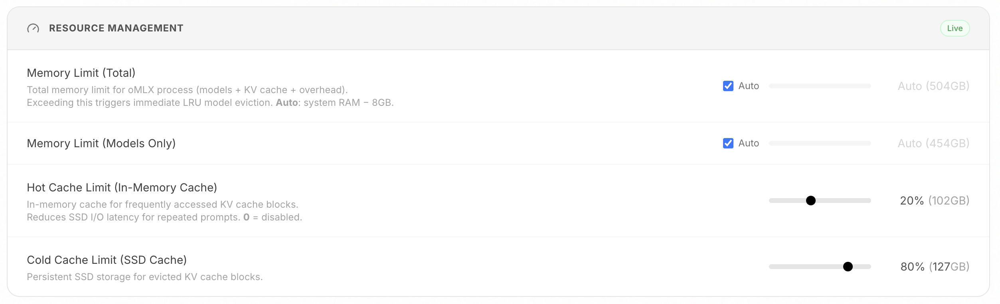

# oMLX (jundot/omlx)


## Bibliographic / source

| Field | Value |
|---|---|
| Title | **oMLX** |
| Tagline | LLM inference, optimized for your Mac |
| Author / maintainer | Jun Kim (`jundot`); contact `junkim.dot@gmail.com` · https://omlx.ai/me |
| Repo | [jundot/omlx](https://github.com/jundot/omlx) |
| Site | https://omlx.ai · benchmarks https://omlx.ai/benchmarks |
| License | Apache-2.0 (`LICENSE` + GitHub API `spdx_id`) |
| Language | Python (FastAPI server) + native Swift/SwiftUI menubar (`apps/omlx-mac/`) |
| Platform | **macOS 15.0+ (Sequoia), Apple Silicon only** (M1–M5). Python **3.11–3.13** (`requires-python = ">=3.11,<3.14"`). Classifiers also list 3.10 — leftover vs requires-python; **Unknown** which is stale. |
| Version at ingest | **0.6.4** (`omlx/_version.py` + GitHub latest release 2026-08-29). `pyproject.toml` `Development Status :: 3 - Alpha`. |
| Default branch / HEAD | `main` @ `e008a66b4703` («formula: bump to 0.6.4», 2026-08-29) |
| Stars / forks / watchers | **21040** / **1785** / **106** subscribers (GitHub API 2026-08-30) |
| Open issues | **1191** (API mixes issues+PRs) |
| Created / last push | 2026-02-13 / 2026-08-29 |
| Config | `~/.omlx/settings.json`; models default `~/.omlx/models`; CLI shim `~/.omlx/bin/omlx`; logs `~/.omlx/logs/server.log` |
| Domain | local LLM/VLM inference on Apple Silicon; continuous batching; tiered KV cache; OpenAI/Anthropic-compatible API |
| Raw capture | [[raw/jundot-omlx-readme]] |
| Fork origin | Started from [vllm-mlx](https://github.com/waybarrios/vllm-mlx) v0.1.0 (author acknowledgment) |

## One-line purpose

Local **OpenAI/Anthropic-compatible inference server** for Apple Silicon: pin everyday models, swap heavy ones, persist KV across RAM+SSD, manage from a native menu bar.

## Thesis (from README + pyproject + release)

1. **Convenience and control.** Pin models in memory, auto-swap heavier ones, set context limits, manage from the menu bar — not a choice between a toy UI and a raw CLI.
2. **Tiered KV cache is the product.** Hot RAM blocks + cold SSD (safetensors), prefix sharing, Copy-on-Write (vLLM-style paging). Matching prefix restores from disk **even after restart**; mid-conversation context changes keep past blocks reusable.
3. **Continuous batching** via mlx-lm `BatchGenerator`. Default `--max-concurrent-requests` **8**.
4. **Drop-in APIs.** `localhost:8000/v1` OpenAI + `POST /v1/messages` Anthropic. Admin at `/admin` (vendored CDN, offline). Chat at `/admin/chat`.
5. **Multi-model pool.** LLM / VLM / OCR / embeddings / rerankers in one process. LRU eviction, pin, per-model TTL, process memory cap default **system RAM − 8GB**.
6. **Coding-agent clients.** README names one-click Integrations for OpenClaw, OpenCode, Codex, **Hermes Agent**, Copilot, Pi. Claude Code extras: scaled token counts so auto-compact fires, SSE keep-alive on long prefill.
7. **Custom Metal kernels are not the default pip path.** Plain `pip install -e .` **does not** build them; GLM-5.2 fused DSA prefill **author claim** ~30× (845 vs ~29 tok/s on M3 Ultra, #2137) and fallback uses more memory. Needs full Xcode `metal`, or official DMG (kernels precompiled), or `brew install … --HEAD --with-custom-kernel`.
8. **MLX pin is ABI-hard.** `mlx==0.32.0`; nanobind `==2.13.0`. Bumping MLX requires rebuilding custom kernels.
9. **Experimental multi-Mac.** Pipeline ranks over Ring / Thunderbolt RDMA/JACCL; source builds; security boundaries in `docs/distributed-cluster.md` (not fetched this ingest).
10. **Stars ≠ maturity.** ~21k stars, created 2026-02-13, **1191** open issues, classifiers still Alpha.

## Architecture snapshot

```
FastAPI Server (OpenAI / Anthropic API)
    │
    ├── EnginePool (multi-model, LRU eviction, TTL, manual load/unload)
    │   ├── BatchedEngine (LLMs, continuous batching)
    │   ├── VLMEngine
    │   ├── EmbeddingEngine
    │   └── RerankerEngine
    │
    ├── ProcessMemoryEnforcer (total memory limit, TTL checks)
    │
    ├── Scheduler (FCFS, configurable concurrency)
    │   └── mlx-lm BatchGenerator
    │
    └── Cache Stack
        ├── PagedCacheManager (GPU, block-based, CoW, prefix sharing)
        ├── Hot Cache (in-memory tier, write-back)
        └── PagedSSDCacheManager (SSD cold tier, safetensors)
```



| Piece | Role |
|---|---|
| `omlx serve` / `omlx start` | Foreground vs managed background (Homebrew `brew services` or macOS app) |
| EnginePool | Many models; pin / TTL / LRU |
| Paged cache | Prefix-reusable KV; SSD offload |
| Menubar app | Native SwiftUI, not Electron; auto-update; crash restart |
| Admin `/admin` | Monitor, download HF MLX models, benchmark PP/TG, one-click client integrations |
| Profiles | `<model>:<profile>` overlay on same engine — no extra VRAM |

### Install surfaces (docs; not run here)

| Path | Notes |
|---|---|
| `.dmg` from Releases | `oMLX-0.6.4-macos15-sequoia.dmg` (~782 MB) and `oMLX-0.6.4-macos26-27.dmg` (~806 MB) |
| Homebrew tap `jundot/omlx` | `omlx start` → brew services |
| `pip install -e .` | Core; `.[mcp]` optional; kernels only with `OMLX_WITH_CUSTOM_KERNEL=1` + full Xcode |

Wheels on the v0.6.4 release: cp311/cp312/cp313 `macosx_15_0_universal2`.

### API (README)

| Endpoint | Description |
|---|---|
| `POST /v1/chat/completions` | Chat (streaming) |
| `POST /v1/completions` | Text (streaming) |
| `POST /v1/messages` | Anthropic Messages |
| `POST /v1/embeddings` | Embeddings |
| `POST /v1/rerank` | Rerank |
| `GET /v1/models` | List (aliases + `<model>:<profile>`) |

Auth: `--api-key`. Localhost-only skip via admin global settings (README).

## Contrast vs vault harness axes

| | oMLX | [[wiki/sources/herdr]] | [[wiki/sources/prime-agent]] | [[wiki/sources/deepseek-harness]] |
|---|---|---|---|---|
| Owns | **Weights + KV** on Apple Silicon | **PTYs** of whatever CLI | Agent loop + IPython | Plugin loop |
| Hermes | One-click **client** pointing at `:8000` (README) | Official session-state plugin | Reference harness | Separate product |
| This Linux host | **Cannot run** | Could, not installed | Not installed | Not installed |

They compose on a Mac: Hermes/Claude Code as client → oMLX as local backend; Herdr can own the PTY of that client.

## Why it matters for `pro/plan`

- Local inference is a **cost/privacy lever** for coding agents — but only on Macs; this Hermes host is Linux.
- Causal split: slow local LLM may be **missing custom kernels** (silent generic fallback), **cold-cache miss**, or **model too big for pin** — not «MLX is slow».
- Claude Code token-scaling is an **interface lie for auto-compact**, not a real context increase. Label it.
- One-click «Hermes Agent» integration is an author claim from README; **not verified** on this host.
- Adjacent to [[wiki/concepts/tiered-kv-cache]] and [[wiki/concepts/efficiency-metric]] (SSD restore vs recompute).

## Status

- **Ingest depth:** README + `pyproject.toml` + `omlx/_version.py` + `LICENSE` head + GitHub API repo/release/HEAD. Not executed. Distributed-cluster doc not fetched.
- **Confidence:** high on install/API/architecture block (README). Medium on speed numbers (author/maintainer benches). Hermes one-click: **Unknown** until a Mac smoke-test.
- **Hermes/Chappy:** **reference only**. Do not install here (wrong OS). Do not write `~/.hermes/config.yaml`.
- **Reading status:** not used in production on this host.

## Next (optional)

- [ ] Fetch `docs/distributed-cluster.md` if multi-Mac becomes a question
- [ ] On an Apple Silicon machine: smoke `omlx serve` + Hermes base URL — only if user asks
- [ ] Verify custom-kernel status command on a real install

## Sources / provenance

- README `main` 2026-08-30, sha256 `231de2c1266513fd125408fbe3d0b5519dedaf84b41b6bb458d8a20c1bfad774` (19694 bytes)
- GitHub API: https://api.github.com/repos/jundot/omlx
- Latest release: https://github.com/jundot/omlx/releases/tag/v0.6.4
- Version attr: `omlx/_version.py` `__version__ = "0.6.4"`
- Images: `assets/external/github.com/4ce67aac66b801c0.svg` (dark icon), `398777b9c82ae66b.svg` (light), `fe6736c62ebdd804.png` (hot/cold diagram)
- Related: [[wiki/entities/omlx]], [[wiki/concepts/tiered-kv-cache]], [[10_Reference/tools/omlx]]
