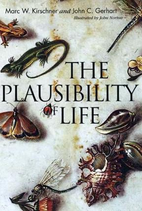

# The Plausibility of Life

## Bibliographic

| Field | Value |
|---|---|
| Title | **The Plausibility of Life: Resolving Darwin's Dilemma** |
| Authors | Marc W. Kirschner, John C. Gerhart |
| Illustrated by | John Norton |
| Publisher | Yale University Press |
| Year | 2005 (hardcover; paperback later) |
| ISBN-13 | 978-0-300-11977-0 (paperback, commonly cited) |
| Domain | evolutionary developmental biology (evo-devo), systems biology |

## Links

- Yale University Press: https://yalebooks.yale.edu/book/9780300119770/the-plausibility-of-life/
- Goodreads: https://www.goodreads.com/book/show/142616.The_Plausibility_of_Life
- Open Library / catalog search: https://openlibrary.org/search?q=The+Plausibility+of+Life+Kirschner+Gerhart
- Wikipedia (if page exists / related): search `The Plausibility of Life Kirschner`

## One-line purpose

Книга о том, **почему эволюция сложных организмов выглядит «правдоподобной»**: как консервативные клеточные/развитийные процессы делают вариацию не случайным шумом, а **facilitated variation** — структурированной, многократно используемой изменчивостью.

## Core thesis (working summary)

Классический дарвинизм хорошо объясняет **отбор**, но слабее отвечает на «dilemma»: откуда берётся **полезное разнообразие фенотипов** без невероятной удачи? Kirschner & Gerhart предлагают механизм:

1. **Conserved core processes** — базовые клеточные и developmental процессы (сигнальные пути, морфогенез, регуляция генов) удивительно стабильны у животных.
2. **Facilitated variation** — эти же процессы *облегчают* появление крупных, жизнеспособных фенотипических изменений при относительно небольших генетических сдвигах (перекомбинация регуляции, слабые связи, exploratory behaviour систем).
3. Эволюция «строится» не из хаоса атомарных мутаций «с нуля», а через **перенастройку уже надёжных модулей** развития.
4. Отсюда правдоподобность (plausibility) сложной жизни: не только отбор, но и **структура вариации**.

## Why it matters for `pro/plan`

- Модель **причинности**: не «мутация → чудо → отбор», а **ограниченная генерация вариантов + фильтр**.
- Аналогия для product/agent design: **stable core + reconfigurable interfaces** даёт высокую exploratory power при низкой стоимости изменений.
- Связь с [[wiki/concepts/causal-analysis|causal analysis]]: различать уровни (генетика / развитие / отбор / экология).
- Возможный концепт для отдельной страницы: `facilitated variation` (пока не выделен).

## Status

- **Ingest source**: Telegram cover photo (`img_7ff91f65864a.jpg`) + known public bibliographic metadata.
- **Depth**: bibliographic + thesis-level summary only; full chapter notes not yet done.
- **Reading status**: not marked as finished.

## Next (optional)

- [ ] Chapter-by-chapter notes as reading progresses
- [ ] Concept page: `wiki/concepts/facilitated-variation.md`
- [ ] Link to related evo-devo / systems biology sources when they appear

## Sources / provenance

- Cover image provided by user (Telegram), stored at `assets/books/the-plausibility-of-life-cover.jpg`
- Authors/title/illustrator taken from cover: Marc W. Kirschner, John C. Gerhart; Illustrated by John Norton
- Bibliographic links and year/publisher from public book records (Yale UP / catalog listings)
